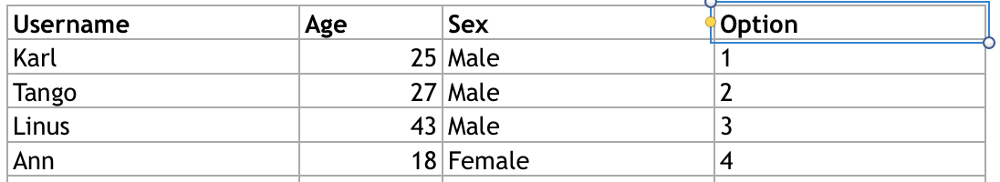

xs
=================

Installation
------------

    go get github.com/KarlTango/xs

Requirements
-------------

* github.com/tealeg/xlsx

Index
------

1. [Examples <a name="examples"></a>](#examples)
   2. [Unmarshal <a name="unmarshal"></a>](#unmarshal)
   3. [Marshal <a name="marshal"></a>](#marshal)

Examples <a name="examples"></a>
--------

### Unmarshal <a name="unmarshal"></a>
**If you wan to get message from a excel file like this:**


(Excel could be found in example folder).

**You could define struct with xs tag to map struct key excel column name**
```golang
type User struct {
	Username string `xs:"Username"`
	Age      int    `xs:"Age"`
	Sex      string `xs:"Sex"`
}
```

**and then you can use UnmarshalFromFile**
```golang
var users = make([]User, 0)
filePath := "example/test.xlsx"
err := UnmarshalFromFile(filePath, &users)
```
**or use Unmarshal**
```golang
var users = make([]User, 0)
filePath := "example/test.xlsx"
body, _ := ioutil.ReadFile(filePath)
err = Unmarshal(body, &users)
```
**Both method is ok. But you should ensure that there is no empty row at the end of excel**


### Marshal <a name="marshal"></a>
**The other way round, if you want to write a excel from go struct slice, you can use Marshal**
#### Mutiple sheet
```golang
type User struct {
	Username string `xs:"Username"`
	Age      int    `xs:"Age"`
	Sex      string `xs:"Sex"`
}

type User2 struct {
	Username string  `xs:"Username"`
	Salary   float64 `xs:"Salary"`
}

var users = []
var users2 = make([]User2, 0)

users := []User{{"Karl", 25, "Male"}, {"Ann", 18, "Female"}}
users2 := []User2{{"Karl", 8000.00}, {"Ann", 9999.50}}

//marshal
body, err := Marshal(users, users2)
if err != nil {
    //TODO: process err
}

//write file
err = ioutil.WriteFile("user.xlsx", body, 06666)
if err != nil {
    //TODO: process err
}
```

